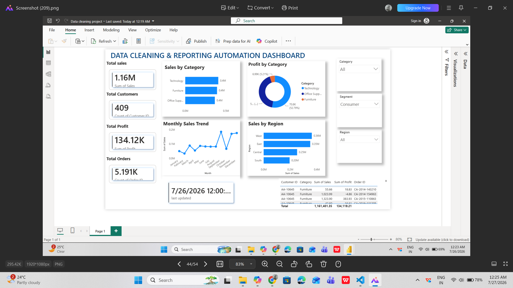

# 📊 Data Cleaning & Reporting Automation

## 📌 Project Overview

This project demonstrates an end-to-end Data Cleaning and Reporting Automation workflow using Python and Power BI.

The workflow includes:
- Data Cleaning
- Missing Value Handling
- Duplicate Removal
- Data Transformation
- Automated Reporting
- Interactive Power BI Dashboard

---

## 🛠 Tools & Technologies

- Python
- Pandas
- NumPy
- Matplotlib
- OpenPyXL
- Power BI

---

## 📁 Project Structure

Data_Cleaning_Reporting_Automation/

├── automation.py

├── Data cleaning project.pbix

├── requirements.txt

├── README.md

├── charts/

├── data/

└── output/

---

## 📊 Dashboard Features

- Total Sales KPI
- Total Profit KPI
- Total Orders KPI
- Total Customers KPI
- Sales by Category
- Profit by Category
- Monthly Sales Trend
- Sales by Region
- Interactive Filters (Category, Segment, Region)

## 📊 Dashboard Preview

---

## 🚀 Output

✔ Cleaned Dataset

✔ Automated Charts

✔ Power BI Dashboard

✔ Business Insights

---

## 👨‍💻 Author

**Lingamoorthi**

B.E Computer Science Engineering

Data Analytics Intern
